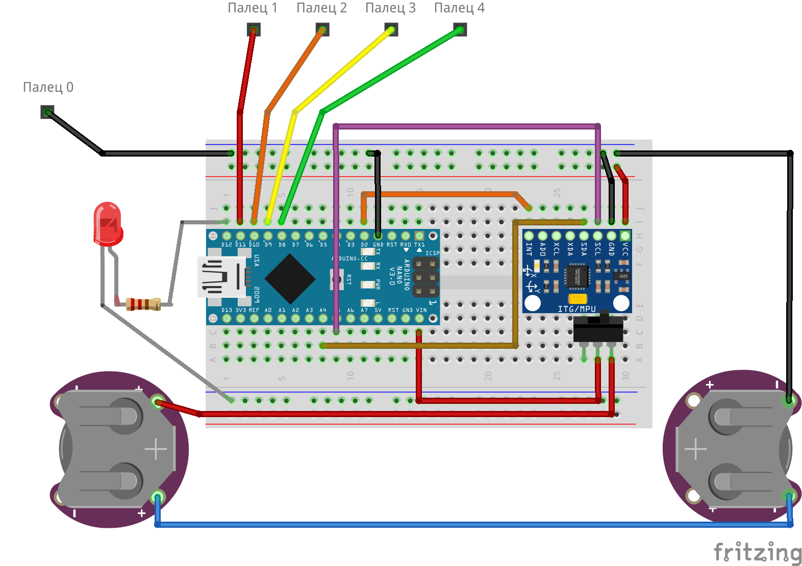

# Hardware

В этом репозитории вы найдете схемы, которые вам предстоит собрать в ходе курса.

# Схема для перчатки управления

# Схема для манипулятора

# Компоненты

| Компонент | Кол-во |
|---|---|
| Arduino Nano| 1 |
| MPU-6050 - акселерометр и гироскоп | 1 |
| Bluetooth модуль HC-05 | 1 |
| Отсек для батареек типа CR2450 | 2 |
| Батарейка CR2450 | 2 |
