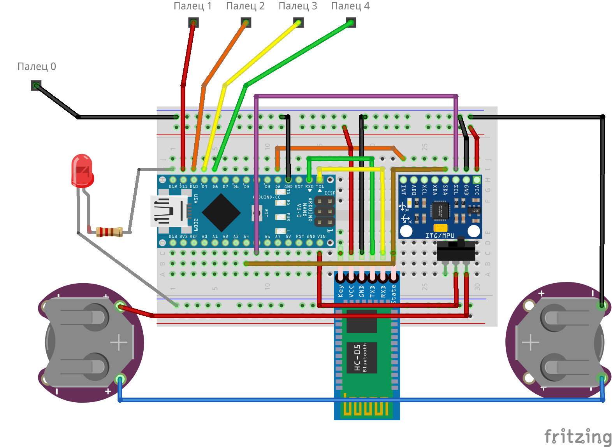

# Hardware

В этом репозитории вы найдете схемы, которые вам предстоит собрать в ходе курса.

# Инструкция по сборке манипулятора
[Здесь](https://create.arduino.cc/projecthub/benbobgray/mearm-robot-arm-your-robot-v1-0-326702) находится официальная инструкция проекта (на английском!)  
[Здесь](https://github.com/the-glovecontroller-team/hardware/blob/master/mearm-instructions.pdf) вы найдёте версию на русском.

# Схема для перчатки управления

# Схема для манипулятора

